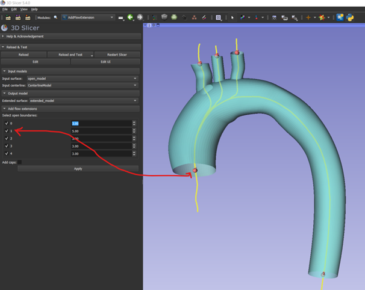

# AddFlowExtension module
This module can be used to add flow extensions to the opened ends of a model geometry. 

### Usage
The module takes two inputs:
- a geometry model to which the extensions should be added
- a centerline model
If you come from the PrepareModelForCFD module, these should already be present in the scene. Use the dropdown menu buttons to select them. If you want to use the AddFlowExtension module as a standalone module, make sure to load a geometry model into 3D slicer, or create a model fro a segmentation. If the model is not yet opened at the vessel ends, make sure to do so. Compute a centerline using 'Extract Centerline' module from the SlicerVMTK extension.

Once a model and centerline have been selected, an output model node is created called 'extended_model'. 

To add flow extensions, select the open boundaries at which the extensions should be placed. The ids are displayed in the 3D geometry. Also specify the length of the extensions (defined as the number of diameters of the open boundary).

If you want to close the model, tick the 'Add caps' checkbox.

When ready, press 'Apply' to add extensions and save the result in the extended_model' node.

[AddFlowExtensions extended model](AddFlowExtensions_1.png)

When you are ready with the clipping, you can return to the PrepareModelForCFD module to continue the workflow, or continue with the 'extended_model' node in whatever way you like. 

