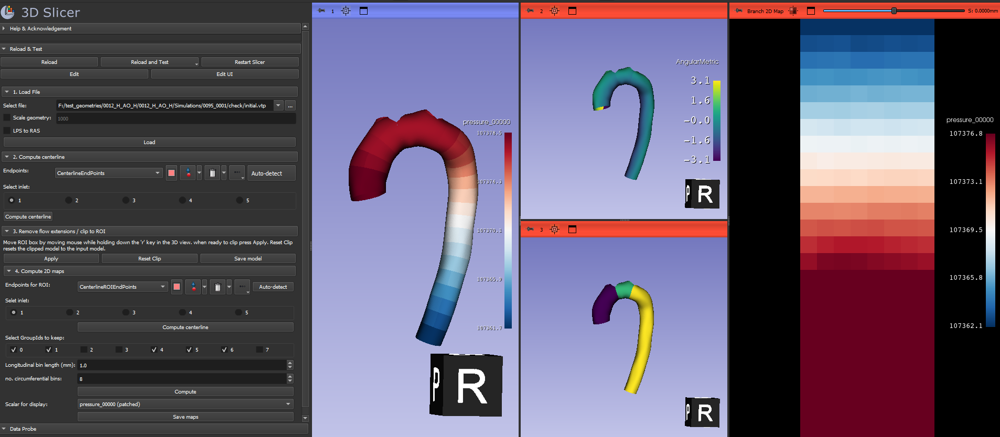

# CFDModelPostProcessing module
This module covers the various steps to postprocess files containing CFD results. These usually are files of surface/wall mesh containing CFD quantities such as pressure, wall-shear-stress etc. in *.tec, *_tec.dat, *.vtp format.
Steps include
1. Load geometry with CFD results from file
2. Compute centerline
3. remove flow extensions/ clip surface to ROI
4. compute flattened 2D maps
5. Save results to file

Note: this module is still in the development phase, so may change significantly between versions.

## Usage
### Step 1: Load wall surface with CFD results from file
Loadable formats: *.tec, *_tec.dat (ascii tec files from Ansys Fluent), *.vtp, *.vtk, *.ply, *.obj, *.vtu

**Note**: Slicer works best when the model geometry is specified in millimeter. Other units may not be displayed well (e.g. meter). If the geometry in your file is in different units, please use the 'Scale geometry' checkbox to scale to mm when loading.

To select the file, press the three dots to navigate to the file location.

There are two options you can check. if the geometry you are loading is not in millimeter, check the 'scale geometry' checkbox and fill in the appropriate scaling factor to scale the geometry to millimeter.

3D slicer assumes data in files are in LPS (Left, Posterior, Superior) coordinates, while Slicer's internal representation uses RAS (Right, Anterior, Superior). Therefore, it may flip the first two axis during read and write operations. If the file you are loading is not in LPS coordinates and you want the model to flip from RAS to LPS or vice versa, check the 'LPS to RAS' checkbox. 

Press 'Load' to load the file. Once loaded it will be displayed in the 3D viewer.

The model will be colored according to the first scalar variable in the list. If you want to display a different scalar variable for visual inspection before proceding with the postprocessing (note, in the current module you can do this directly after computation in step 4), you can navigate to the 'Models' module, select the model under investigation, scroll down to the 'Scalars' dropdown window, and then select the Active scalar you want to display.

### Step 2: Compute centerline
This step is based on Extract Centerline module's logic from SlicerVMTK extension.

For centerline computation endpoints are required. You can add them manually by creating a new EndPoints node and adding control points to it, or guess the endpoints by pressing the 'Auto-detect' button.

After pressing the Auto-detect button, the guessed endpoints will be displayed in the 3D view. In the module itself, the ids of endpoints will be displayed. Make sure the right id is selected for the inlet. The centerlines will start from the selected inlet. For now, centerlines can only be computed starting from a single inlet.

You can click-and-drag an endpoint in the 3D view to improve its placement. You can remove an endpoints if it is not correct by right clicking the endpoint in the 3D view and selecting 'delete control point'. You can add an endpoint by clicking the 'add control point' button in the markups place widget in the module window.

When the endpoints are correctly placed, press 'Compute' to compute the centerline.

### Step 3: Remove flow extensions / clip to ROI
Once the centerline has been computed, it can be used to remove the flow extensions that may have been added for simulation purposes, but have no physical meaning in the final CFD analysis. You may also want to clip the model further to include a smaller ROI area in you final analysis. 

After the centerline has been computed, a ROI box will be displayed on the model that can be moved w.r.t. the computed centerline by pressing 'r'. 
You can move the box along the centerline by pressing 'r' and moving the mouse in the 3D view. Note: for Slicer versions below 5.4.0 you may need to press 'SHIFT' and 'r' simultaneously to move the box along the centerline. If the box doesn't move, try to click or rotate the model in the 3D view to make the view active.

You can also position and/or resize the box manually using the colored dots (e.g. extend it in one direction to cover the inlet/outlet, drag the blue/green/red dots to resize the box). Note that if you want to manually rotate the box, you need to display the rotation handle. To do this, hover over one of the points of the box with the mouse, then right mouseclick to open the menu. Under 'Interaction options', check 'Rotate' to display a rotation handle that lets you rotate the box.

s
Position the box to the desired clip. Once you are ready to clip, press Apply. The opened surface model will be stored in the model node 'open_model'.

You can continue clipping the model until the flow extensions have been removed and/or you have obtained your ROI. You can reset the clipping by pressing the button 'Reset Clip'. This will reset all the clips and reset the model to the original. You may save the clipped model by pressing the 'Save model' button. This will save the model under its original name with *_ROI appended in vtp format to the same folder from which the input model was loaded.

### Step 4: Compute 2D maps
The final step in the postprocessing workflow allows to compute 2D maps of variables of interest (e.g. wall-shear-stress) from the 3D simulation results. 

First step is to recompute the centerline for the clipped geometry from step 2. To detect endpoints for the centerline, press 'Auto-detect' and prepare the endpoints for centerline computation as described under Step 2. Make sure to Select the correct id corresponding to the inlet.

After computation of the centerline, the centerline is split into branches. The branch IDs are displayed in the 3D view as well as in the module GUI. Indicate which branches you want to use in the 2D map under 'Select GroupIds to keep':

Next, decide on the longitudinal bin length (in mm) and the number of circumferential bins. This will determine the size of the patches for the 2D maps.

Once ready, press 'Compute'. The computation may take a while. After computation is finished, results will be displayed in several windows. To select the variable which you want to display, use the 'Scalar for display' dropdown button. Here you can select the original scalars from the CFD simulation file (these will not be displayed in the 2D maps where their patched counterparts are shown, but will be visible in the 3D geometry), or the patched scalars, i.e. the scalars that have been grouped and averaged into lower resolution patches. The patched scalars are indicated by the suffix (patched) in the dropdown list. 

After selecting the variable of interest, results are shown in the views. The most left view (view 1) shows the variable on the 3D geometry. The top middle view, view 2, displays the AngularMetric, i.e. the angle w.r.t. the centerline. Where the AngularMetric flips from negative to positive is the cutting line for the 2D maps. The bottom middle view, view 3, displays the group ids of the different branches, which shows which branch is which in the 2D map view on the right. The branches are numbered from low to high in the direction of the centerline.

The most right view is a tabbed view showing, for each branch of the vessel, the 2D mapped and patched variable of interest. 

To save the results, press the 'Save maps' button. This will save several files to the same folder the input file was in:
- XXX_patching.vtp: the mapped and patched 3D geometry file containing all the variables (original and patched)
- XXX_BranchX_patching.vtp: the mapped and patched 3D geometry file of branch X containing all the variables (original and patched)
- XXX_BranchX_VARIABLE_2DMap.csv: comma separated value file containing the 2D map of the displayed variable VARIABLE for branch X. This file can be read into excel or other software for further (statistical) analysis
- XXX_BranchX_VARIABLE_2DMap.png: png image of the 2D map of the displayed variable VARIABLE for branch X. 

If you want to save results (especially the 2D maps) for several variables, be sure to select them one by one in the 'Scalar for display' dropdown list and press 'Save maps' for each of the variables.

Note that at the moment the 2D maps in the most right view cannot display the original (high resolution, not patched) variables. Instead, it will always display the patched variable. This will be made possible in future releases.

