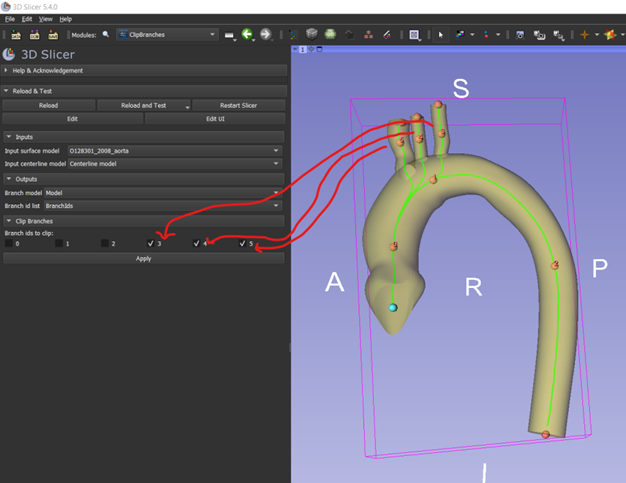
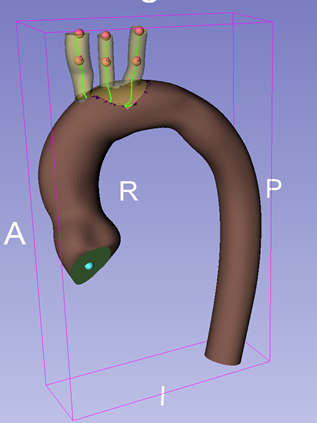

# ClipBranches module
This module can be used to divide a geometry model and clip branches in relation to its split and grouped centerlines. Convenience module based on vmtkbranchclipper.

NOTE: This module is still under construction.

## Usage
The module takes two inputs:
- a geometry model from which branches must be clipped
- a centerline model. Note that the module works best with the centerline model computed fro the Vascular Modeling Toolkit's 'Extract Centerline' module (SlicerVMTK extension).

The module generates two outputs:
- the branched model: specify the node or create a new model node with the dropdown menu button.
- a list of branc ids: specify the node or create a new point list node with the dropdown menu button.

Once the inputs and outputs have been set, the ids for the branches that can be clipped will be displayed. Check which ones you want to remove and press 'Apply' 

