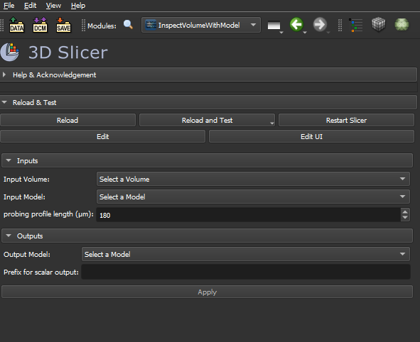
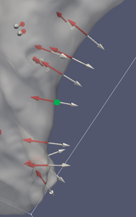
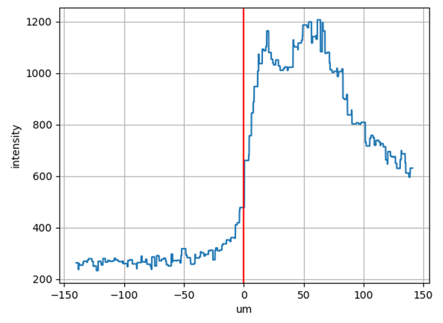

# InspectVolumeWithModel module
This module can be used to probe an image volume with a surface model.

## Usage
The module takes three inputs:
- the image volume to be probed
- a surface model for which to compute representative image intensity values.
- a probing profile length in micrometer. This is the length of the linear profile that will be used normal to each vertex of the surface model to compute a representative image intensity at the vertices of the surface model.

Outputs:
- Output model: the surface model with the computed intensity values, these are the scalars profileMean and profileMax, optionally prefixed by the string specified in the 'prefix for scalar output' box.s
- prefix for scalar output: optional, set a prefix string to be added to the output scalar name

The figure below illustrates the linear profiles that are computed normal to the model surface vertices:

The image volume is sampled at each vertex of the surface model along the linear profile normal to the vertices. This is done to reduce effects from errors in segmentation. For example, if the segmentation does not follow the lumen exactly, probing the image only at the vertex location might miss the actual intensity value at the lumen, as is illustrated in the figure below. Considering a linear profile and reporting the mean and the max of the voxels that are crossed by this profile is more robust.

