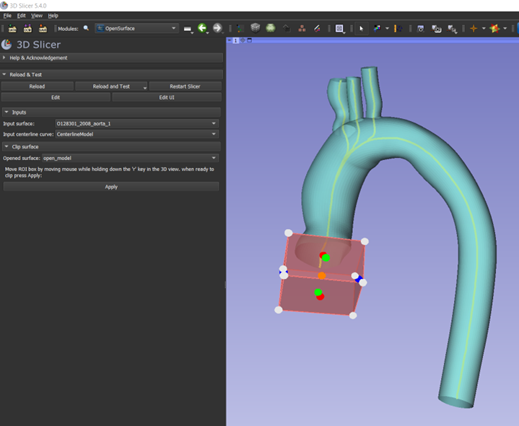
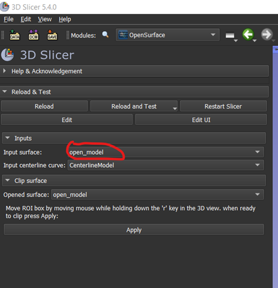
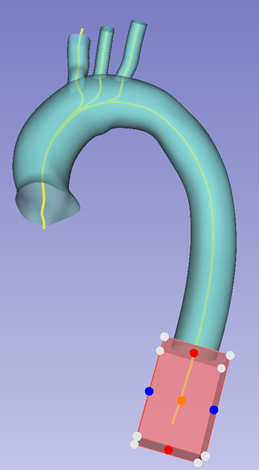

# OpenSurface module
This module can be used to clip a model geometry using a box oriented normal to the geometry's centerline. 

### Usage
The module takes two inputs:
- a geometry model
- a centerline model
If you come from the PrepareModelForCFD module, these should already be present in the scene. Use the dropdown menu buttons to select them. If you want to use the OpenSurface module as a standalone module, make sure to load a geometry model into 3D slicer and compute a centerline using 'Extract Centerline' module from the SlicerVMTK extension.

Once a model and centerline have been selected, a clipping box will be displayed. You can move the box along the centerline by pressing 'r' and moving the mouse in the 3D view. Note: for Slicer versions below 5.4.0 you may need to press 'SHIFT' and 'r' simultaneously to move the box along the centerline. If the box doesn't move, try to click or rotate the model in the 3D view to make the view active.

You can also manually position and/or resize the box manually using the colored dots (e.g. extend it in one direction to cover the inlet/outlet, drag the blue/green/red dots to resize the box).

Position the box to the desired clip. Once you are ready to clip, press Apply. The opened surface model will be stored in the model node 'open_model'.

After the initial clip, to continue clipping the opened model make sure to change the input surface from the original surface to the already clipped surface, e.g. the 'open_model node.

When you are ready with the clipping, you may return to the PrepareModelForCFD module to go the next step in the workflow, or continue with the 'open_model' model node in whatever whay you like.

