# PrepareModelForCFD module
This module covers the complete workflow to prepare a geometry for meshing and subsequent CFD simulation. The workflow contains the following steps:
1. Load model from file (e.g. stl format)
2. Compute centerline
3. Open the model at the in- and outlets
4. Add flow extensions at the in- and/or outlets
5. Save model back to file.

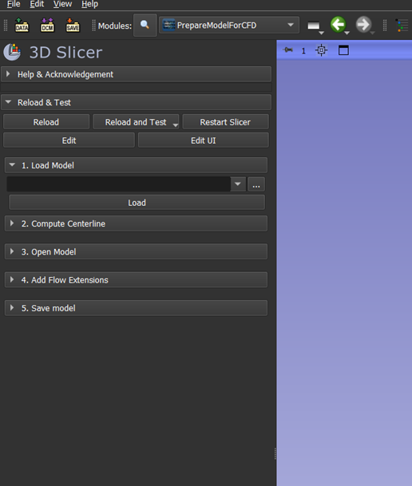

## Usage
### Step 1: Load model from file
Loadable formats: stl, vtk, vtp, ply, obj, vtu

**Note**: Slicer works best when the model geometry is specified in millimeter. Other units may not be displayed well (e.g. meter).

To select the file, press the three dots to navigate to the file location.

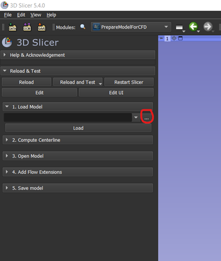

Press 'Load' to load the file. Once loaded it will be displayed in the 3D viewer.

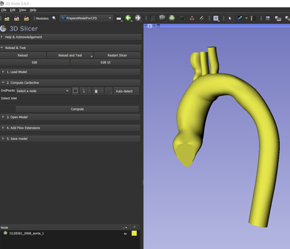

### Step 2: Compute centerline
This step is based on Extract Centerline module's logic from SlicerVMTK extension.

For centerline computation endpoints are required. You can add them manually by creating a new EndPoints node and adding control points to it, or guess the endpoints by pressing the 'Auto-detect' button.

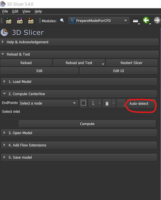

After pressing the Auto-detect button, the guessed endpoints will be displayed in the 3D view. In the module itself, the ids of endpoints will be displayed. Make sure the right id is selected for the inlet. The centerlines will start from the selected inlet. For now, centerlines can only be computed starting from a single inlet.

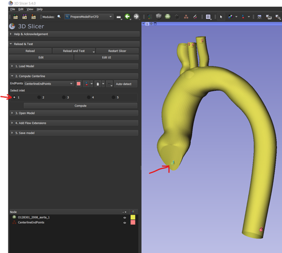

You can click-and-drag an endpoint in the 3D view to improve its placement. You can remove an endpoints if it is not correct by right clicking the endpoint in the 3D view and selecting 'delete control point'. You can add an endpoint by clicking the 'add control point' button in the markups place widget in the module window.

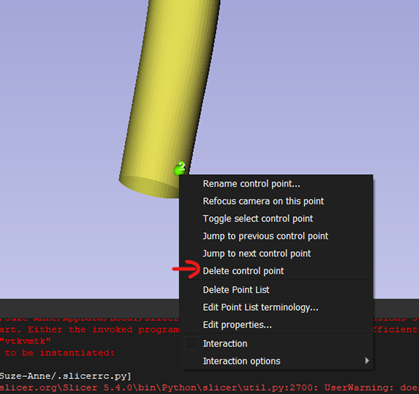

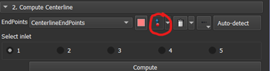

When the endpoints are correctly placed, press 'Compute' to compute the centerline.

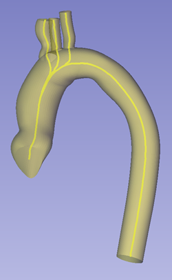

### Step 3: Open surface
This step uses the [OpenSurface Module](OpenSurface.md). Navigate to the module by pressing 'Go To OpenSurface Module'. The PrepareModuleForCFD module is left and OpenSurface module will be opened. 

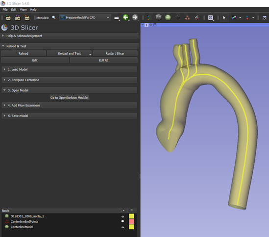

When you are finished working on the geometry in the OpenSurface module, you can navigate back to the PrepareModelForCFD module through the Modules History button at the top toolbar.

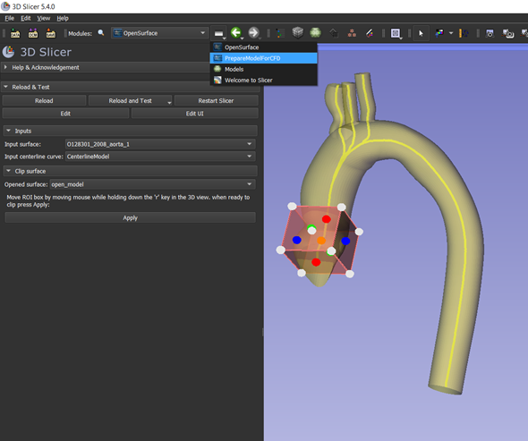

### Step 4: Add Flow Extensions
This step uses the [AddFlowExtensions Module](AddFlowExtensions.md). Open step 4 by clicking the collapsible button 4. Click the 'Go to AddFlowExtensions Module' to leave the PrepareModelForCFD module and open the AddFlowExtensions module. 

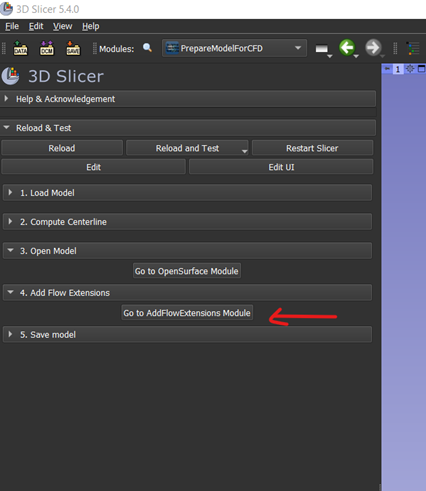

When you are finished working on the geometry in the AddFlowExtensions module, you can navigate back to the PrepareModelForCFD module through the Modules History button at the top toolbar.

### Step 5: Save processed model to file
If you are in another module, navigate back to the PrepareModelForCFD module. Open 'step 5: Save Model'. Press the 'Save model(s)' nutton. This will open the 'save scene and unsaved data' dialog, where you can select the files you want to save, the file formats, and the directory where to save to.

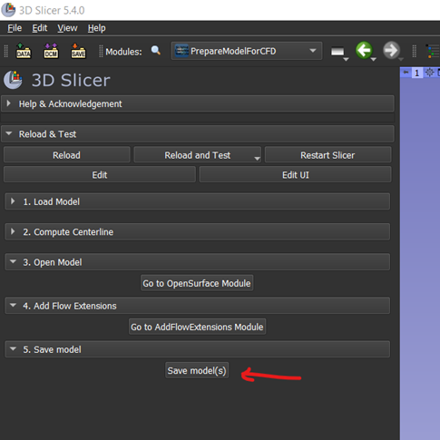

Save the final model and any additional information if desired (such as the mrml scene for later reload in Slicer, the computed centerline, intermediate models etc.)

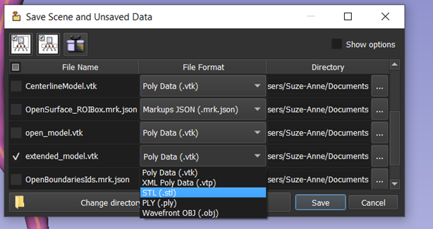
